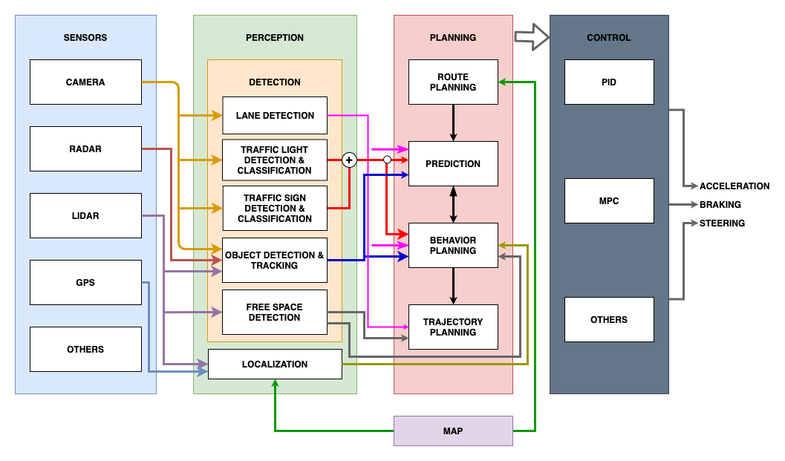
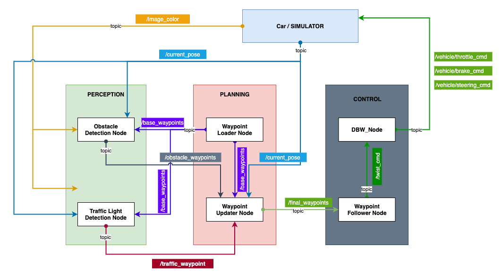

# System Integration Project

[](http://www.udacity.com/drive)

The System Integration Project is the capstone project for the Udacity Self-Driving Car Engineer Nanodegree.  the autonomous vehicle would run in a simulation environment. that is famous Carla.


According to the requirements of the project, I  only create parts of **perception** **planning** and **control** subsystems.

- Traffic Light Detection Node publish the index of the waypoint for nearest upcoming red light's stop line to a single ```topic:/traffic_waypoint```

- Waypoint Update Node is to publish a fixed number of waypoints ahead of the vehicle with the correct target velocities, depending on traffic lights and obstacles.

- DBW Node is going to be subscribing to the twist command topic and publish *brake steering throttle* commands for the car.



The project ROS architecture is part of the implementation of Carla's system.

### Docker Installation

[Install Docker](https://docs.docker.com/engine/installation/)

Build the docker container

```bash
docker build . -t capstone
```

Run the docker file

```bash
docker run -p 4567:4567 -v $PWD:/capstone -v /tmp/log:/root/.ros/ --rm -it capstone
```

### Run

1. Clone the project repository

```bash
git clone https://github.com/udacity/CarND-Capstone.git
```

2. Install python dependencies

```bash
cd CarND-Capstone
pip install -r requirements.txt
```

3. Make and run styx

```bash
cd ros
catkin_make
source devel/setup.sh
roslaunch launch/styx.launch
```

4. Run the simulator

### Built With

- Be sure that your workstation is running Ubuntu 16.04 Xenial Xerus or Ubuntu 14.04 Trusty Tahir. [Ubuntu downloads can be found here](https://www.ubuntu.com/download/desktop).

- If using a Virtual Machine to install Ubuntu, use the following configuration as minimum:
  - 2 CPU
  - 2 GB system memory
  - 25 GB of free hard drive space

  The Udacity provided virtual machine has ROS and Dataspeed DBW already installed, so you can skip the next two steps if you are using this.

- Follow these instructions to install ROS
  - [ROS Kinetic](http://wiki.ros.org/kinetic/Installation/Ubuntu) if you have Ubuntu 16.04.
  - [ROS Indigo](http://wiki.ros.org/indigo/Installation/Ubuntu) if you have Ubuntu 14.04.
- [Dataspeed DBW](https://bitbucket.org/DataspeedInc/dbw_mkz_ros)
  - Use this option to install the SDK on a workstation that already has ROS installed: [One Line SDK Install (binary)](https://bitbucket.org/DataspeedInc/dbw_mkz_ros/src/81e63fcc335d7b64139d7482017d6a97b405e250/ROS_SETUP.md?fileviewer=file-view-default)
- Download the [Udacity Simulator](https://github.com/udacity/CarND-Capstone/releases).

### Versioning

- We use [SemVer](http://semver.org/) for versioning. For the versions available, see the [tags on this repository](https://github.com/your/project/tags).

### Authors

- **Tom Ge** - *Self-Driving Car egineer* - [github profile](https://github.com/tomgtqq)

### License

- This project is licensed under the MIT License
